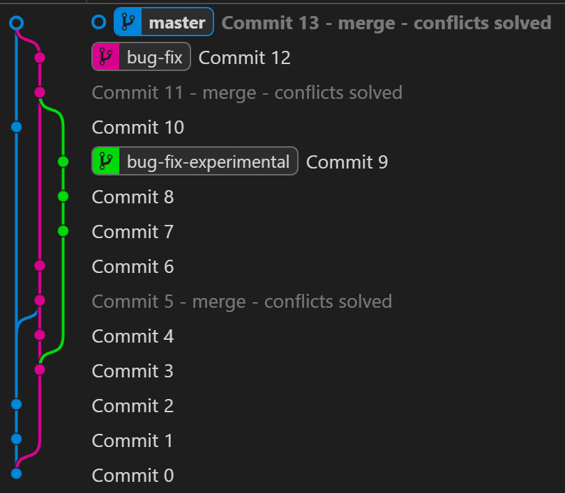

# Commit 0
git init  
git add File.md  
git commit -m "Commit 0"  
# Commit 1
git add .  
git commit -m "Commit 1"  
# Commit 2
git add .  
git commit -m "Commit 2"  
# Commit 3
## Getting a list of commit hashes so I know what commit 0 was. Commit 0 hash first 4 chars: f4f3.
git log  
git branch bug-fix f4f3  
git checkout bug-fix  
git add .  
git commit -m "Commit 3"  
# Commit 4
git add .  
git commit -m "Commit 4"  
# Commit 5
git merge master  
git add .  
git commit -m "Commit 5 - merge - conflicts solved"  
# Commit 6
git add .  
git commit -m "Commit 6"  
# Commit 7
## Getting hash of Commit 4 (eef6) and branching from it.
git log  
git checkout -b bug-fix-experimental eef6  
git add .  
git commit -m "Commit 7"  
# Commit 8
git add .  
git commit -m "Commit 8"  
# Commit 9
git add .  
git commit -m "Commit 9"  
# Commit 10
git checkout master  
git add .  
git commit -m "Commit 10"  
# Commit 11
git checkout bug-fix  
git merge bug-fix-experimental  
git add .  
git commit -m "Commit 11 - merge - conflicts solved"  
# Commit 12
git add .  
git commit -m "Commit 12"  
# Commit 13
git checkout master  
git merge bug-fix  
git add .  
git commit -m "Commit 13 - merge - conflicts solved"  
# Commit 14
  
git add .  
git commit -m "Commit 14 - add image"  